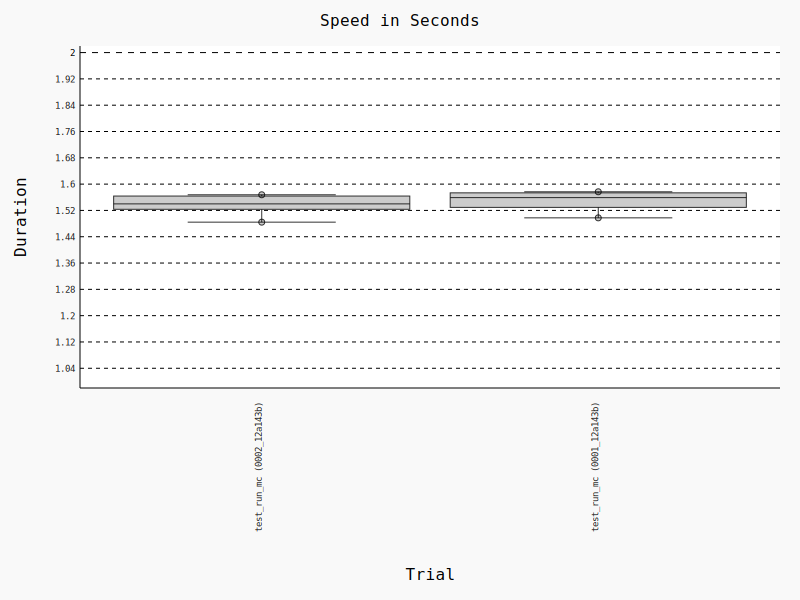

Benchmarking
============

The CLEASE test suite contains a benchmarking sub-suite as well, which can be useful
for testing new code. If the adjusted code is not tested in the benchmarking suite yet,
and is performance sensitive, please remember to add a new benchmark test.

.. note::

    Running the benchmarks requires the extra requirements  the ``test`` installation, e.g.
    from a ``pip install .[test]`` install.

The benchmarks must be enabled via pytest, and is run via the
`pytest-benchmark <https://pytest-benchmark.readthedocs.io/>`_ extension.
Running a normal ``pytest`` command will simply skip the benchmarking tests,
as they are assumed to be more expensive to run. Therefore, the recommended way to
execute the benchmarks, is to tell pytest to only execute tests marked for benchmarking,
e.g. from the CLEASE root directory:

.. code-block:: bash

    pytest --benchmark-only --benchmark-autosave tests/

Alternatively, *tox* can be used to execute the benchmarks, which is roughly equivalent to the
above command:

.. code-block:: bash

    tox -e benchmark

The ``--benchmark-autosave`` option saves a benchmark run to the ``.benchmarks/`` folder
in the root directory.
Two runs from the benchmark can be compared, for example doing

.. code-block:: bash

    pytest-benchmark compare --histogram benchmark 0001 0002

would generate a histogram file called ``benchmark.svg``. The compare also generates a text output,
and example is shown :download:`here <_benchmark/benchmark.txt>`. You can omit the ``--histogram benchmark``
flag to just get the text comparison.
The run ID's are granted automatically, so in this example the first and second run were automatically
named ``0001`` and ``0002``. Omit the numbers to simply compare every previous benchmark run.
For more details on how to compare benchmarks, please see the
`pytest-benchmark <https://pytest-benchmark.readthedocs.io/>`_ docs. The following is an example of
what this histogram can look like:

.. note::

    Running benchmarks is highly sensitive to the machine, and to other processes running
    on the machine. So to ensure a fair comparison, always compare results from the same machine
    under as similar loads as possible.
