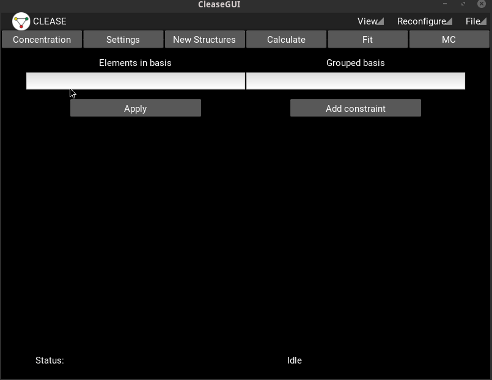
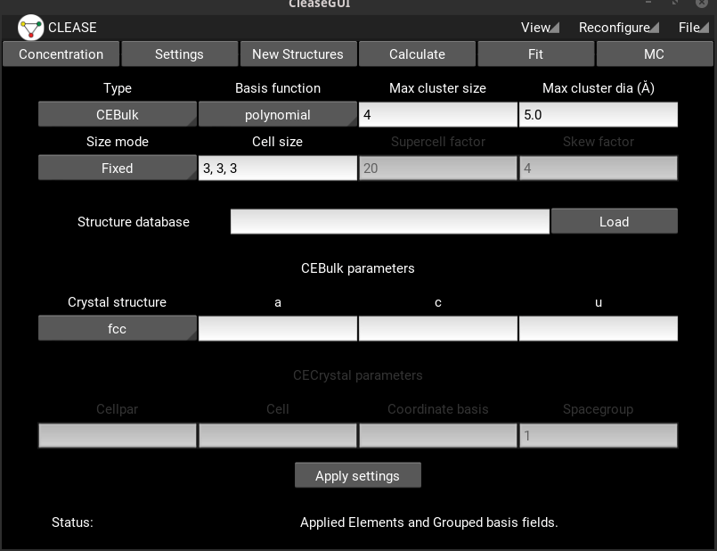
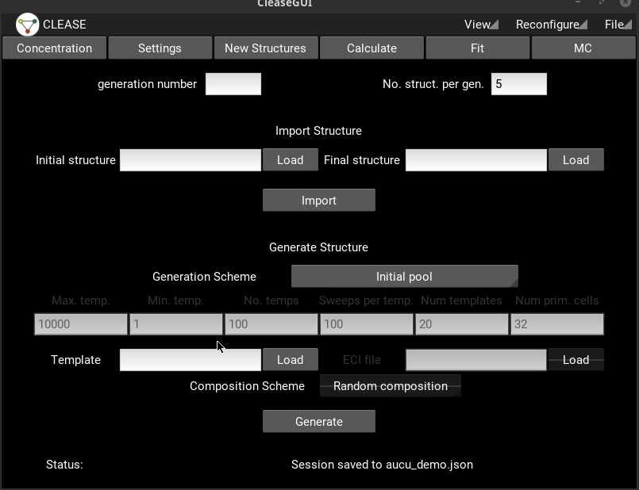
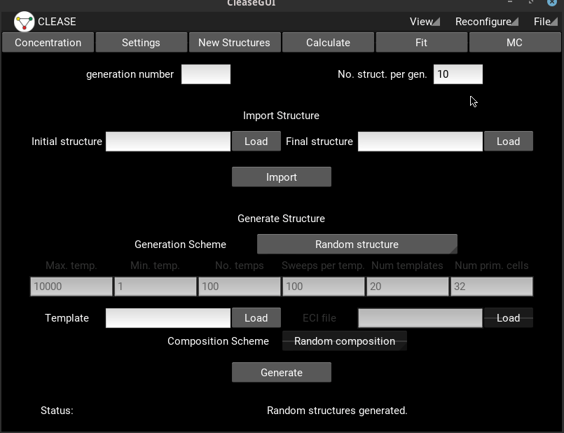
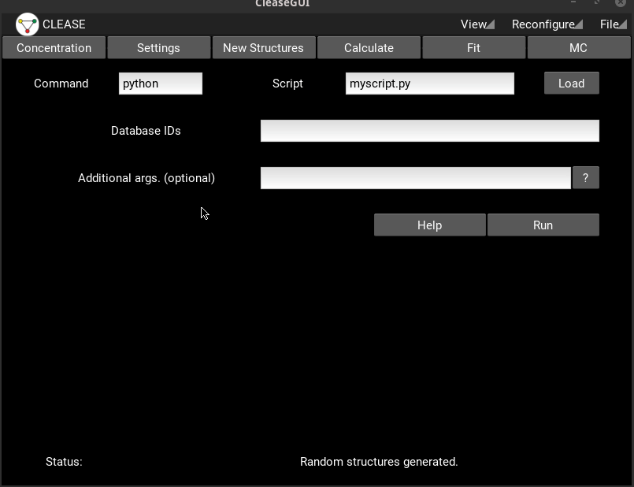
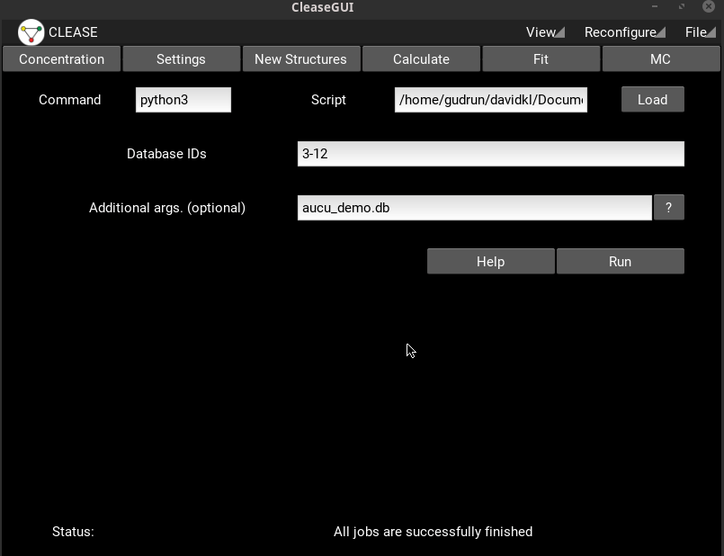
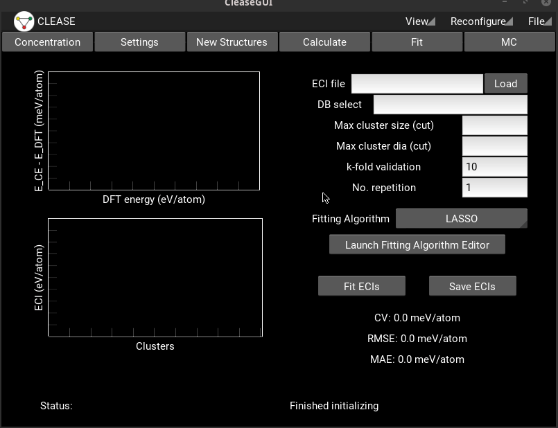
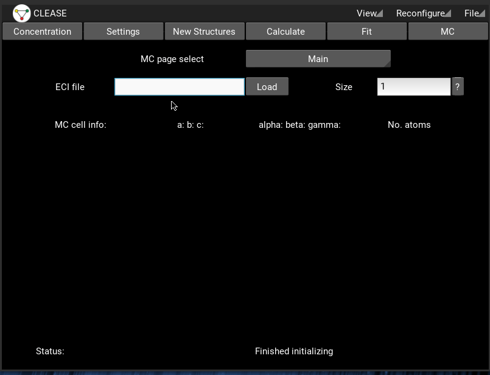
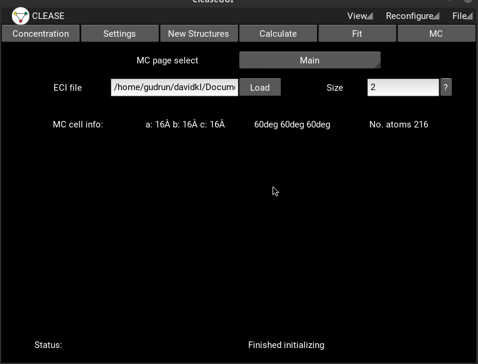
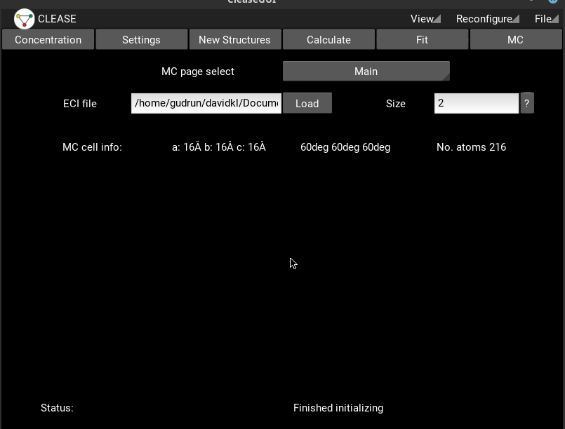

=====================
Using GUI to run CE
=====================
CLEASE comes with a handy graphical user interface (GUI) that can be used to
set up and manage your CE project. You can install the GUI dependencies by
running

.. code-block:: bash

    clease gui-setup

You can install the dependencies manually if the above command does not work
for some reason, as stated in `README <https://gitlab.com/computationalmaterials/clease/blob/master/README.md>`_ page.

Let's proceed with the binary Au-Cu alloy example. First, open the GUI by

.. code-block:: bash

    clease gui

Then, we need to specify the elements

Next, we move to the **Settings** panel to specify the CE settings parameters.
The relavant parameters we need to specify are:

1. Scheme to construct the unit cell. We can use either *bulk* or *crystal*
   function in ASE. The *crystal* function is more flexible, but the *bulk*
   function is easier to use. The *bulk* function is sufficient for the
   Au-Cu alloy as it has the FCC lattice. Hence, we keep the default *CEBUlk*.

2. Which basis functions to use for the expansion. Let's keep the default
   option of *polynomial*.

3. The number of atoms in the largest cluster. Again, we keep the default value
   of 4.

4. The cutoff distance in Angstrom.

5. The cell size we want to use for our training structures.

6. The name of the database file where all structures are stored.

7. Input parameters of ASE's *bulk* function.

We are now ready to generate some structures! Let's navigate to the
*New Structures* panel and generate the initial pool of training structures.
Then, we add another 10 random structures to our training pool.

We can view which structures CLEASE has generated by looking into the database.

We see that we have a bunch of structures which is of type *initial*. These are
the ones you need to run with DFT. By looking in the name column, we also see
that there are structures called *primitive_cell* and *templates*. These you
don't need to worry about, they are used internally by CLEASE.

The next step is to actually run calculations on the structures suggested by
CLEASE. This is done on the *Calculate* page. Since CLEASE aims at being
compatible with all calculators, this is done by running your own script.
For the sake of the tutorial, we are going to use the EMT calculator
distributed with ASE. There are certain requirements to the script

1. The first command line argument is the ID to the database
2. The script update the database with `clease.tools.update_db` function

Additional arguments can be specified as a comma separated list in the
*Additional args.* field, and it is up to your script to parse them. Below is
:download:`an example script <resources/demo_script.py>`. In short, we take
the ID of the structure to run as the first argument, then we pass the name of
the database as the second. The script relaxes the cell and writes the result
into the database.

.. literalinclude:: resources/demo_script.py

Let's download this script and put it in your current project folder. Then
we check which IDs are not converged and run those. In the *Command* field
you specify the name of the *python* command to run. In most cases the default
(python) is fine.

After the calculation is finished, we can one again check how the database
looks like.

We see that the calculations we where running is now marked as converged.
Moreover, new entries with type *final* has appeared. Since we now have
data, it is time to fit effective cluster interactions. We head to the
*Fit* page. First, we specify a file where we want to store our ECI. Then
we set how many partitions we want to split our dataset into in order to
check the prediction error of our model. Then we select a fitting algorithm,
for now we choose *L2* and we open the *Fitting Algirithm Editor* in order
to tune the parameters of the fitting algorithm we selected.

When we hit *Fit ECIs* two plots appear. The top one shows the difference
between the predicted energy and the DFT energy (or in our case it EMT).
The lower plot shows how strong different cluster interactions are. The
color represents how many atoms there are in each cluster.

In order to achieve a good CE model, we should try to minimize the CV. There
are several ways of doing that

1. Go back to *New Structures* and generate more structures for the training set.
   That can be more random structures, search for ground states using the ECIs
   we just found etc.

2. Tune the hyperparameters of the fitting algorithm

3. Try different fitting algorithms

Running Monte Carlo Calculations
=================================
When you are happy with the fitted CE model, proceed to run some actual MC calculations.
As a starter, it can be interesting to calculate the average energy as a function of temperature
and concentration. To do that, we go to the MC page, specify the file containing our ECIs and
specify the size of the MC cell. Let's not be too ambitious when it comes to system size in this
tutorial.

We now proceed to the page called **Canonical**. Here, we need to specify a database
where CLEASE will put information from the MC run. Each **AtomsRow** in this database
will contain the **last** structure on each temperature. But there will be additional
entries with the internal energy and a few other useful quantities. We specify a set
of temperatures as a comma separated list, then we give the concentration of each
element. The order of the concentrations, need to match the elements you speciffied on
the **Concentration** page.

Free Energy At Varying Order Parameters
========================================================
CLEASE offers the calculations of free energies as a function of arbirary macroscopic parameters.
For the interested reader, a thorogh description of the theory can be found :ref:`here <metadynSampling>`.
These calculation can be quite heavy, but a simple case suited for this is to recover the free energy of an
ideal mixture. That can be done by running the AuCu system at very high temperature. First, we open the
*ensemble editor* and enter the allowed symbols and a chemical potential. When you hit *Run*,
the sampler will start to explore the configurational space.
The top plot on the left side is the current best estimate of the free energy, and the buttom plot tracks
how often the sampler has visited a particular value of our macroscopic parameter. The simulation converges
when the *least* frequently visited bin is higher than the lowest line. After the calculation is converged,
we can obtain a more accurate estimate of the free energy by lowering the *Modification factor* and run the
calculation again.

