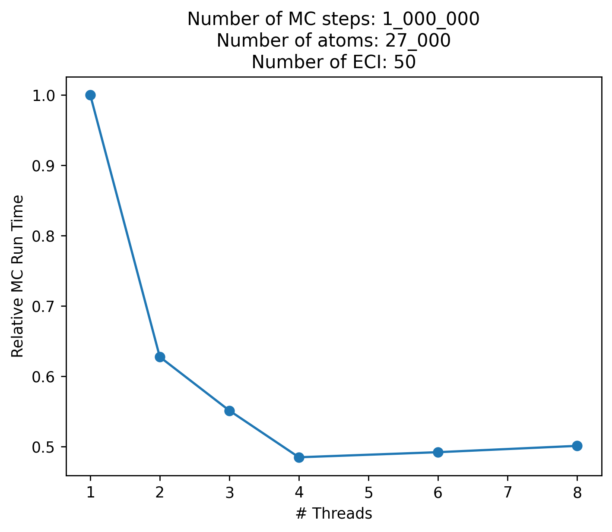

Parallelization
================

Clease has an **expermental** support for OpenMP when calculating the correlation functions.
It currently only kicks in when updating correlation functions, e.g. during Monte Carlo
simulations.

.. note::
    This feature is experimental, and only tested on Unix systems.

    Also, the API may be subject to change.

.. note::

    Initial testing hasn't shown much improvement past 2-4 threads, as the load balancing
    is very uneven, since parallelization is done across each ECI value.

    Models with few ECI values will therefore also gain less from parallelization.
    Remember to do your own testing.

Installation
------------
In order to use the OpenMP feature, CLEASE needs to be compiled with the OpenMP flag
enabled in your compiler. For most systems, the compiler will be ``gcc``, where
the flag is ``-fopenmp``. This flag can be enabled by setting the ``CLEASE_OMP`` environment
variable when installing with pip.

.. code-block:: bash

    $ CLEASE_OMP=-fopenmp pip install clease --no-cache-dir --no-binary=clease

.. note::
    This only works when installing CLEASE via pip.

Testing the install
-------------------

Once you have installed, check your CLEASE installation with the command

.. code-block:: bash

    $ clease info

If the line ``C++ OpenMP`` says ``True``, your install should be configured correctly.

Running in parallel
-------------------

If the above command returns ``True``, you can run with thread parallelization.
Simply run your Monte Carlo simulations as normal, but adjust ``num_threads`` parameter
in your :class:`~clease.calculator.clease.Clease` class, e.g. via the ``attach_calculator``
helper function.

.. code-block:: python

    >>> atoms = attach_calculator(settings, atoms, eci, num_threads=2) # Use 2 threads
    >>> mc = Montecarlo(atoms, 5000)
    >>> mc.run(1_000)

Below are some timings for an AuCu cell normalized to the runtime for
1 thread (lower is better):

